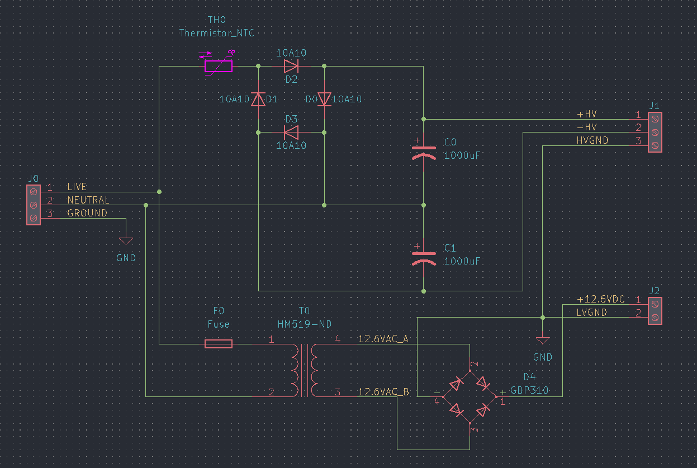

+++
title = "Tesla Coil: Power Supply Board Design"
date = 2022-02-23
+++

The power supply for my coil needs to fill two roles.  It must generate a 340V DC voltage (max 10A) and a minimum 12V DC voltage (max 1A).  I started my design from [Plasma Prince's design](https://oshwlab.com/PlasmaPrince/sstc-doubler).

I initially used a KBU1010 bridge rectifier in my design, however, I was concerned about the pin clearances with the voltages in use.  I opted to use discrete 10A10 diodes.  These rectify the flow before going through a pair of chunky electrolytic capacitors to double the voltage.  I retained the NTC in the design to deal with inrush current.  For the low voltage side, a step down transformer brings 120VAC down to 12.6VAC.  I know the downstream driver board will likely use a 7812 regulator, so the extra 0.6V ensures it doesn't drop out.  A GBP310 bridge rectifier is used to convert AC to DC.  Since the power socket will have a 10A fuse, I need a separate fuse for the low voltage side

{{ model(poster="model-poster.png", alt="power supply render", src="power-supply.glb") }}

To save on board space, the transformer will be hooked up via a barrier block.  The fuse holder chosen mounts the fuse vertically